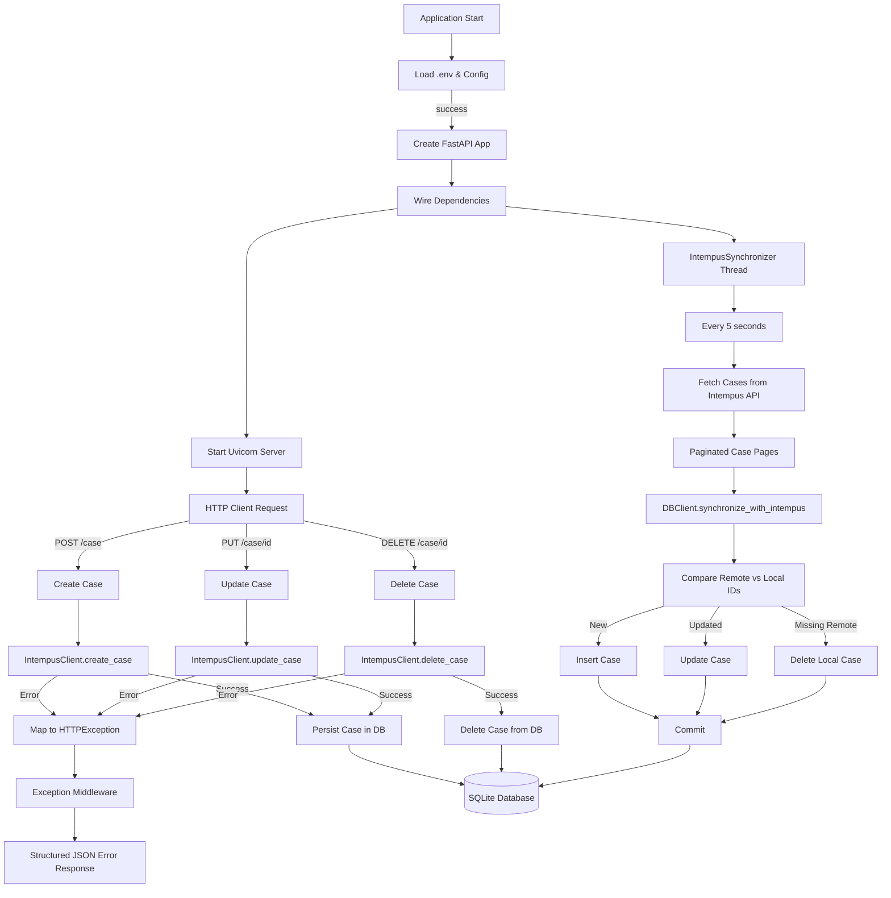

# Intempus Case Synchronization Service

## Usage
### Setup
First ensure that you have [uv](https://docs.astral.sh/uv/#installation) installed. This will install all required dependencies and manage your Python version.

The application expects the following environment variables to be present:

```
INTEMPUS_API_URI=https://intempus.dk/web/v1
INTEMPUS_API_USER=
INTEMPUS_API_KEY=
DB_NAME=intempus_sync.db
API_PORT=9001
```

Either add them to an env-file in `.\.dev\.env.dev` or supply them manually. Unit tests by default looks for `.\.dev\.env.test` and uses an in-memory SQLite DB, see example:

```
INTEMPUS_API_URI=https://intempus.dk/web/v1
INTEMPUS_API_USER=
INTEMPUS_API_KEY=
DB_NAME=:memory:
API_PORT=9001
```

### Running
To execute the main application run `uv run main.py` from the root folder. The API will be available at [http://localhost:{port}/case](http://localhost:9001/case). To execute unit tests run `uv run pytest` or `uv run pytest --runslow`. The slow test has a runtime of several minutes which is why it is not included by default.

## Architecture
The application is structured as a modular monolith with a REST-api and an asynchronus service that performs synchronization with Intempus by a set interval. The intention behind this design is that while they share several components they could be lifted to separate services without breaking significant coupling.

Intempus acts as the master for synchronization. All updates performed via this service are first persisted in Intempus before being persisted to the local system to minimize any kind of desynchronization in what data is generated from persisting a Case. Because of this the local system simply mirrors the DTOs exposed by Intempus.

The local database is used as a document storage for simplicity and brevity.

The below diagram gives a high level overview of the system flow.



Note that the synchronization client only runs every 5 seconds for demonstration purposes.

Dependency choices were focused on simplicity and my prior experience with them.

## Notes
The synchronization client currently only supports full synchronization, which accommodates create, update, and delete operations, because deletes cannot be tracked without walking all cases in both databases. This could be complemented with a faster variation that only supports create and update using [Intempus logical timestamps](https://intempus.dk/web-doc/v1/#intempus-updates), but it was omitted for time.

The test suite primarily contains test focused on the most complex block of the application, the synchronization with Intempus. A sample of tests are added for the create-method for the db client as a sample but was not repeated for the other CRUD operations. The Intempus API client was not prioritized for tests since it is relatively thin but one test is included to showcase unit testing for failing requests. In a production scenario this would most likely be expanded into a full integration test that also verifies the DTOs against the Intempus spec.

I don't worry about failing to persist something that was successfully persisted in Intempus when performing CRUD-ops on the basis that the synchronization is resilient enough to capture any Cases which haven't been succesfully persisted locally, regardless of when it happened.